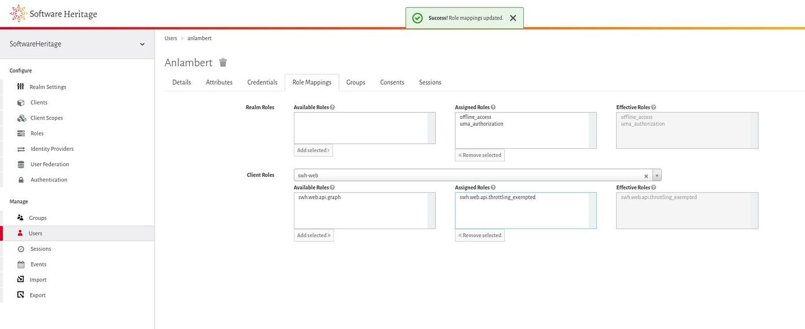

.. _keycloak:

Keycloak
========

.. contents::
   :depth: 3
..

Software Heritage uses `Keycloak <https://www.keycloak.org/>`__, an open
source identity and access management solution, to identify and
authenticate users on its services (for instance the Web API).

Keycloak implements the `OpenID Connect <https://openid.net/connect/>`__
specification, a simple identity layer on top of the OAuth 2.0 protocol.
It allows to get single sign-on (SSO) on various services.

The base URL to interact with that authentication service is
https://auth.softwareheritage.org/auth/.

Introduction
------------

Keycloak defines three important concepts to know about:

Realm
  It manages a set of users, credentials, roles, and groups. A user belongs
  to and logs into a realm. Realms are isolated from one another and can only manage and
  authenticate the users that they control.

Client
  Entities that can request Keycloak to authenticate a user. Most often,
  clients are applications and services that want to use Keycloak to secure themselves and
  provide a single sign-on solution. Clients can also be entities that just want to
  request identity information or an access token so that they can securely invoke other
  services on the network that are secured by Keycloak.

Role
  It identifies a type or category of users. Applications (e.g. webapp,
  deposit) often assign access and permissions to specific roles rather than individual
  users as dealing with users can be too fine grained and hard to manage. There is a
  global namespace for roles and each client also has its own dedicated namespace where
  roles can be defined.

.. _software_heritage_realms:

Software Heritage Realms
------------------------

Two realms are available for Software Heritage:

-  `SoftwareHeritageStaging <https://auth.softwareheritage.org/auth/admin/SoftwareHeritageStaging/console/>`__,
   for testing purposes

-  `SoftwareHeritage <https://auth.softwareheritage.org/auth/admin/SoftwareHeritage/console/>`__,
   for production use

The links above target the Admin console of each realm from which
everything can be configured.

.. _realm_administration:

Realm administration
--------------------

.. _user_registration:

User registration
^^^^^^^^^^^^^^^^^

While public user registration is available by clicking on the "Register" link from the
login page, realm administrators can still manually create a new user by following that
guide.

To register and invite a new user in a realm, click on the **Users** menu entry on the
left part of the admin interface, then click on the **Add user** button on the top right
part of the users page.

.. figure:: keycloak_add_user_01.jpg
   :alt: keycloak_add_user_01.jpg
   :width: 1000px

   Click on the Add user button

Then fill in the form with basic information about the user: username,
email, first name and last name.

Save the user and then go to the **Credentials** tab.

.. figure:: keycloak_add_user_02.jpg
   :alt: keycloak_add_user_02.jpg

   Fill in information on user

We are now going to send a mail to the user telling him that an account
has been created for him with a link to verify his email, set his
password and update its profile if needed.

Go to **Credential Reset** section and insert the **Verify Email** , **Update Password**
and **Update Profile** actions into the **Reset Actions** field. Increase the **Expires
In** value to 24 hours and then click on **Send Mail**.

.. figure:: keycloak_add_user_03.jpg
   :alt: keycloak_add_user_03.jpg
   :width: 1000px

   Send the invite and reset password email

The user account will be active once the email verified, the password changed and the
profile validated.

.. _setting_user_permissions_for_a_given_client:

Setting user permissions for a given client
^^^^^^^^^^^^^^^^^^^^^^^^^^^^^^^^^^^^^^^^^^^

User permissions are defined as client roles in the Keycloak semantics. That guide
explains how to set client roles for an existing user.

As an example, we will set the **swh.web.api.throttling_exempted** role associated to
the **swh-web** client enabling to lift rate limit for the Software Heritage Web API.

To edit a user, click on the **Users** menu entry on the left part of the admin
interface, then click on the **View all users** button on the top left part of the users
page.

Then select the user you want to set permission and click on the
**Edit** action.

   List and select user for edition

Once the user details interface is displayed, click on the **Role Mappings** tab then
type the name of the client containing the roles to add for the user in the **Client
roles** combobox and select it.

The client roles will then be displayed in multiple lists.

.. figure:: keycloak_add_user_permission_02.jpg
   :alt: keycloak_add_user_permission_02.jpg
   :width: 1400px

   Edit the client role

To add a client role for the user, select the one of interest in the **Available Roles**
list and click on the **Add selected** button.

To remove a client role for the user, select the one of interest in the **Assigned
Roles** list and click on the **Removed selected** button.

And that's it, assigned roles can then be found in the JSON Web Tokens generated by
Keycloak.

.. figure:: keycloak_add_user_permission_03.jpg
   :alt: keycloak_add_user_permission_03.jpg
   :width: 1400px

   Assign client role

   Client role assigned
