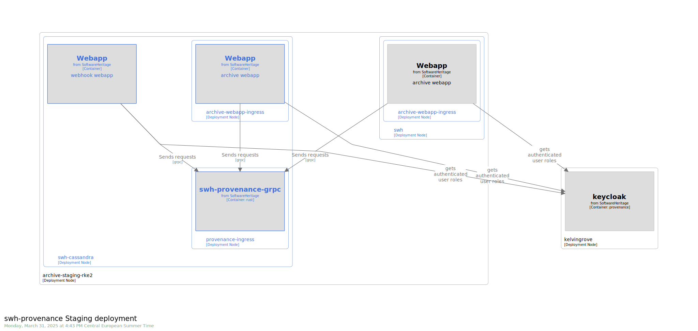
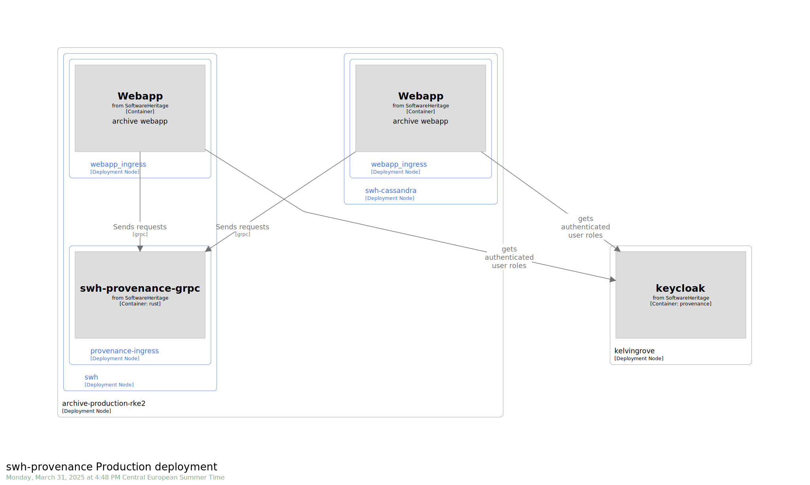

.. _provenance-overview:

Provenance Overview
===================

.. admonition:: Intended audience
   :class: important

   staff members

The provenance application is a standalone grpc server. It does not depend on other swh
services.

This application is running in a kubernetes cluster (production, staging). It's used
through the web api and can be used by staff members (through the vpn).

There is no writing, only read-only queries.

Its backend relies on parquet files.

Authentication
^^^^^^^^^^^^^^

Through the standard web api authentication mechanism.

Web api users have access to the provenance api when they are affected the
`swh.web.api.provenance`.

Staff members have direct access to the provenance api.

Datasets
^^^^^^^^

The provenance needs 2 datasets:

- "versioned" parquet files: the main database queried by the provenance server

- complemented by the following "versioned" graph files:

   - graph.pthash
   - graph.pthash.order
   - graph.node2swhid.bin
   - graph.node2type.bin
   - graph.nodes.count.txt
   - graph.property.message.bin
   - graph.property.message.offset.bin
   - graph.property.tag_name.bin
   - graph.property.tag_name.offset.bin

Note: The version of the graph files should be the same version as the graph which
generated the provenance parquet files.

Internal Domains
^^^^^^^^^^^^^^^^

As the provenance will be used through the webapi, there is no public domain, only
internal.

For each environment, the hostnames will be:
- staging: `provenance.internal.staging.swh.network`
- production: `provenance.internal.softwareheritage.org`

Architecture
^^^^^^^^^^^^

### Staging

### Production

