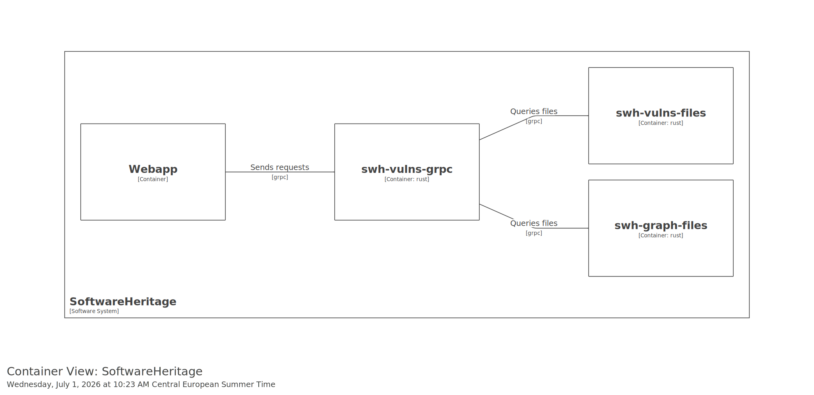

.. _vulns-overview:

Vulns Overview
==============

.. admonition:: Intended audience
   :class: important

   staff members

The vulns application is a standalone grpc server. It does not depend on other swh
services. It depends on the graph dataset files and a specifically generated dataset for
the vulnerabilities.

This application is running in a kubernetes cluster (production, staging). It's used
through the web api and can be used by staff members (through the vpn).

There is no writing, only read-only queries.

Its backend relies on parquet files.

Authentication
--------------

Through the standard web api authentication mechanism.

Web api users have access to the vulns api when they are affected the
`swh.web.api.vulns`.

Staff members have direct access to the vulns api.

Datasets
--------

The vulns needs 2 datasets:
- the "versioned" graph files
- the same "versioned" files queried by the vulns server:

   - all.sqlite
   - commit2vuln_without_cherrypicks.*
   - connected_components.wccs

Note: The version of the graph files should be the same version as the graph which
generated the vulns parquet files.

Internal Domains
----------------

As the vulns will be used through the webapi, there is no public domain, only
internal.

For each environment, the hostnames will be:
- staging: `vulns.internal.staging.swh.network`
- production: `vulns.internal.softwareheritage.org`

Architecture
------------

