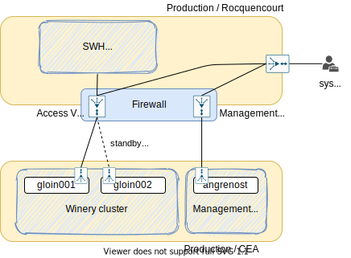
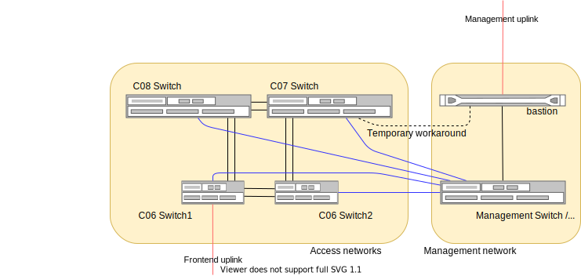

.. _winery-network:

Winery Network Documentation
============================

.. admonition:: Intended audience
   :class: important

   sysadm staff members

VPN Access
----------

The winery environment is hosted in a CEA's datacenter.

All the traffic between the main |SWH| datacenter and the CEA datacenter is encapsulated in an
IPSEC VPN.

A second IPSEC VPN is available to reach the management network in case an access to the servers's
IDRac is needed.

\* This is the target, currently (2024-03-06), the access vpn is not up and all the traffic
is handled by the management VPN.

Network configuration
---------------------

The network equipment are organized like this:

The management and access networks are physically isolated.

Each server has a physical link plugged to 2 different switches with LACP activated for the access
network.

The details of the installation is available in the
`internal inventory <https://inventory.internal.admin.swh.network/dcim/rack-elevations/?site_id=7>`_

The network is composed several ip ranges:

============ ====================== ============================ ======== ==== ==== ======== =======
Range        Description            VLAN                         Frontend MONs OSDs Switches Bastion
============ ====================== ============================ ======== ==== ==== ======== =======
X.X.X.X/28   Uplink vlan            Uplink - Frontend / ID CEA   X
X.X.X.X/28   Uplink vlan            Uplink - Management / ID CEA                             X
10.25.6.0/24 Default / installation Default / 1                  X        X    X
10.25.1.0/24 VLAN for ceph access   Ceph clients / 2             X        X    X
10.25.2.0/24 VLAN for ceph internal Ceph cluster / 3                           X
10.25.3.0/24 Management addresses   None                         X        X    X    X
============ ====================== ============================ ======== ==== ==== ======== =======

Inside each range, the addresses are dispatched according these rules:

========= =========
Type      Range
========= =========
Frontend  .1-.10
MONs      .11-.20
OSDs      .21-.100
Switches  .240-.253
GW        .254
========= =========

