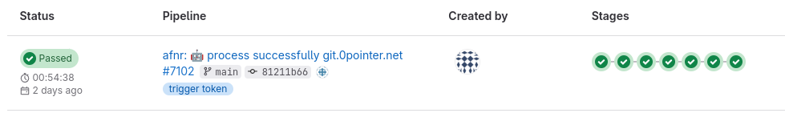
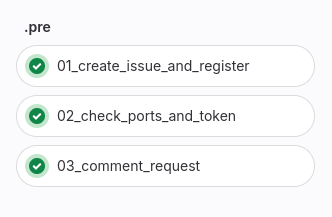
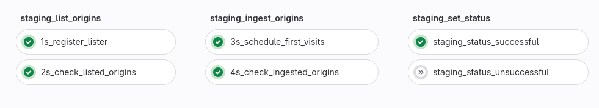
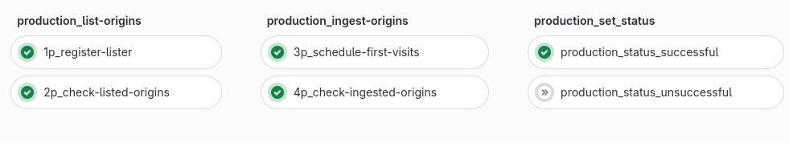
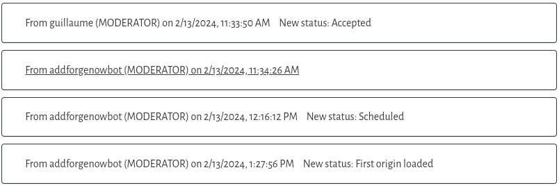
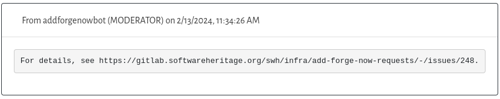
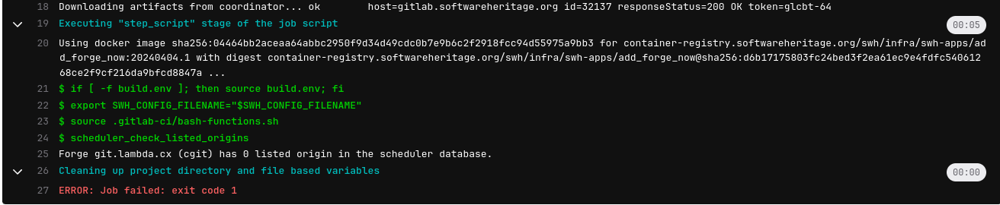
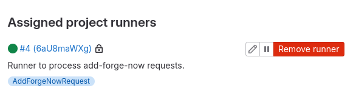

.. _how-to-add-forge-now-pipeline:

Add-forge-now automation
========================

.. admonition:: Intended audience
   :class: important

   sysadm staff members

When a request status is updated to ``Accepted``, a Gitlab pipeline is triggered to process the request.

* `Add-forge-now Archive <https://archive.softwareheritage.org/admin/add-forge/requests/>`_
* `Add-forge-now-requests Repository <https://gitlab.softwareheritage.org/swh/infra/add-forge-now-requests>`_
* `Add-forge-now-requests CI/CD Analytics <https://gitlab.softwareheritage.org/swh/infra/add-forge-now-requests/-/pipelines/charts>`_

.. _add-forge-now-pipeline:

Pipeline
--------

| To overview the pipelines,
  see `Add-forge-now-requests Pipelines <https://gitlab.softwareheritage.org/swh/infra/add-forge-now-requests/-/pipelines>`_.
| To see only the running pipelines,
  see `Add-forge-now-requests Running Pipelines <https://gitlab.softwareheritage.org/swh/infra/add-forge-now-requests/-/pipelines?page=1&scope=all&status=running>`_.
| To view the pipeline details, click on the pipeline status.
| To view the job details, click on the stage and choose a job.

.. admonition:: Concurrent jobs
   :class: note

   | Only ten concurrent pipelines can be processed at the same time.
   | It can be changed on ``runner0``:

   .. code-block:: console

    root@runner0:~# awk '/concurrent/' config.toml
    concurrent = 10

|afnr_pipeline|

.. _add-forge-now-pre-stage:

Pre stage
---------

| The first job create a Gitlab issue with the forge URL in the title.
| To overview the issues,
  see `AFN issues, <https://gitlab.softwareheritage.org/swh/infra/add-forge-now-requests/-/issues>`_.
| The second job check the SWH components ports,
  the forge URL (https) availability and the webapp token validity (recreate it if needed).
| The last job of the ``pre`` stage add a comment on the webapp request with the Gitlab issue URL.

|afnr_pipeline_pre_stage|

.. _add-forge-now-staging-stages:

Staging stages
--------------

| The second, third and fourth stages process the request in staging environment.
| If the all jobs are successfully completed, the request status is updated to ``Scheduled`` and
  a comment is added to the Gitalb issue.

|afnr_pipeline_staging_stages|

.. _add-forge-now-production-stages:

Production stages
-----------------

| The fifth, sixth and seventh stages process the request in production environment.
| If all the jobs are successfully completed, the request status is updated to ``First Origins Loaded``,
  a comment is added to the Gitlab issue and this issue is closed.

|pipeline_production_stages|

.. _add-forge-now-request-status:

Request status
--------------

* **pre** stage add a comment on request;
* if the **staging** stages are successfully completed, the request status is updated to ``Scheduled``;
* if the **production** stages are successfully completed, the request status is updated to ``First Origin Loaded``.

|afnr_request_status|

All comments contain the url of the issue where to find the associated pipeline.

|afnr_request_comment|

.. _add-forge-now-common-pipeline-errors:

Common errors
-------------

|afnr_errors|

Here is a list of common pipeline errors:

- Stage `pre`, job `02_check_ports_and_token`:
    - error: the network ports checks failed;
    - cause: one of the SWH components are unreachable or the forge URL (https) is unreachable;
    - relaunch the job.
- Stage `*_list_origins`, job `2*_check_listed_origins`:
    - error: ``Forge <forge> (<type>) isn't registered in the scheduler database.``;
    - cause: the lister pod creation take more time than the listing delay (600s);
    - relaunch the job.
- Stage `*_list_origins`, job `2*_check_listed_origins`:
    - error: ``Forge <forge> (<type>) has 0 listed origin in the scheduler database.``;
    - cause: the lister failed to find some origin;
    - process request manually (most of the time, need `base_git_url` parameter).
      See :ref:`How to process add-forge-now requests <how-to-add-forge-now-process-requests>`
- Stage `*_ingest_origins`, job `4*_check_ingested_origins`:
    - error: ``There are too many ingestion failures.``;
    - cause: ingestion failures > 70%;
    - check ingestion (lot of empty repositories,...) and swh platform (objstorage unavailable,...);
      process request manually (combination of `url` and `base_git_url`).
- Any stage, any job (generally in job `4p_check-ingested-origins`):
    - error: ``ERROR: Job failed: execution took longer than 168h0m0s seconds``;
    - cause: job timeout (7d);
    - relaunch the job.

Gitlab-runner
-------------

| The Gitlab-runner is dedicated to the add-forge-now-requests project.
| The `CI/CD settings <https://gitlab.softwareheritage.org/swh/infra/add-forge-now-requests/-/settings/ci_cd>`_ page contains:
| - the ``Runners`` section to check the runner's status and update the runner configuration;

|afnr_gitlab-runner|

| - the ``Variables`` section to check, retrieve or update the variables that need to be protected and masked;

.. admonition:: Webapp Token
   :class: note

   If the webapp token is expired and not renewed (normally it should), the pipeline will fail in third job of **pre** stage.
   You can update the variable ``WEBAPP_TOKEN`` in this section.

| - the ``Pipeline trigger tokens`` section to check or change the pipeline token.
|
| It runs on **runner0** virtual machine with a docker executor.

``docker-compose.yml``

.. code:: yaml

   version: "3"
   services:
     gitlab-runner:
       image: gitlab/gitlab-runner:alpine
       container_name: gitlab-runner
       restart: always
       volumes:
         - "/run/docker.sock:/var/run/docker.sock"
         - "gitlab_gitlab-runner:/etc/gitlab-runner"
         - "./config.toml:/etc/gitlab-runner/config.toml"

   volumes:
     gitlab_gitlab-runner:

Runner configuration file ``config.toml``

.. code:: yaml

   concurrent = 10
   check_interval = 0
   shutdown_timeout = 0

   [session_server]
     session_timeout = 1800

   [[runners]]
     name = "add-forge-now-runner"
     url = "https://gitlab.softwareheritage.org"
     id = 4
     token = "xxx"
     token_obtained_at = 2023-10-12T14:12:16Z
     token_expires_at = 0001-01-01T00:00:00Z
     executor = "docker"
     [runners.cache]
       MaxUploadedArchiveSize = 0
     [runners.docker]
       tls_verify = false
       image = "ruby:2.7"
       privileged = false
       disable_entrypoint_overwrite = false
       oom_kill_disable = false
       disable_cache = false
       volumes = ["/cache",
           "/etc/swh/scheduler-staging.yml:/etc/swh/scheduler-staging.yml",
           "/etc/swh/scheduler-production.yml:/etc/swh/scheduler-production.yml"]
       shm_size = 0

Check the runner version and status:

.. code:: bash

   root@runner0:~# alias dck
   alias dck='docker compose'
   root@runner0:~# dck exec -ti gitlab-runner gitlab-runner --version
   Version:      16.10.0
   Git revision: 81ab07f6
   Git branch:   16-10-stable
   GO version:   go1.21.7
   Built:        2024-03-21T19:43:25+0000
   OS/Arch:      linux/amd64
   root@runner0:~# dck exec -ti gitlab-runner gitlab-runner verify
   Runtime platform                                    arch=amd64 os=linux pid=177 revision=81ab07f6 version=16.10.0
   Running in system-mode.

   Verifying runner... is valid                        runner=6aU8maWXg
