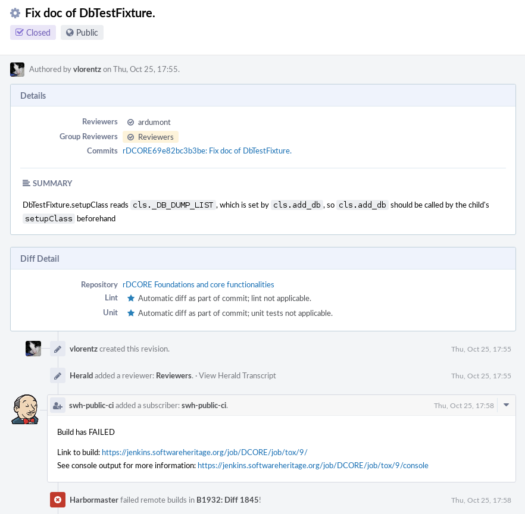
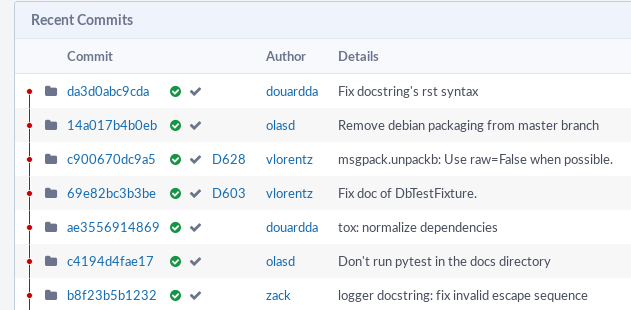

.. _ci_jenkins:

Jenkins
=======

.. admonition:: Intended audience
   :class: important

   staff members

The CI is run by `Jenkins <https://jenkins.io/>`_ on jenkins.softwareheritage.org.

Authentication
--------------

Software Heritage staffers can login via the Jenkins Web user interface using the same
personal ``*nix`` credentials they use to login into other machines.

Jobs
----

There are 3 categories of jobs:

- jenkins maintenance, e.g. running Jenkins Job Builder, updating and managing docker
  images. These are found in the `jenkins-tools
  <https://jenkins.softwareheritage.org/job/jenkins-tools/>`_ directory.
- testing/building swh packages: unit tests, docs, debian build, ...
- testing/building swh packages' external dependency packages (not already packaged in
  debian)

.. _jobs_definition:

Jobs definition
~~~~~~~~~~~~~~~

Most of the jobs are created using `Jenkins Job Builder
<https://docs.openstack.org/infra/jenkins-job-builder/>`_ (aka JJB). The jobs are
declared in the `dedicated source repository
<https://gitlab.softwareheritage.org/swh/infra/ci-cd/swh-jenkins-jobs>`_.

Each time a new revision is pushed on this repo, the `JJB job
<https://jenkins.softwareheritage.org/job/jenkins-tools/job/swh-jenkins-job-builder/>`_
is executed. This job updates existing jobs or creates new ones (if any). Beware not to
break the JJB job!

.. _job_execution_environments:

Job execution environments
~~~~~~~~~~~~~~~~~~~~~~~~~~

Jenkins job execution may occur either on the Jenkins master node directly (typically
for `jenkins-tools <https://jenkins.softwareheritage.org/job/jenkins-tools/>`_ jobs), or
in a docker jenkins slave.

Docker images used by Jenkins are created and updated using the `Dockerfiles
<https://gitlab.softwareheritage.org/swh/infra/ci-cd/swh-jenkins-dockerfiles>`_.

For now, there are 2 different images:

- swh-jenkins/tox: a Debian buster with python3 and tox installed; used to run unit
  tests; it's available in Jenkins under the label `swh-tox
  <https://jenkins.softwareheritage.org/label/swh-tox/>`_
- swh-jenkins/sphinx: based on the former tox image, it adds everything needed to
  compile the documentation with sphinx; it's available in Jenkins under the label
  `swh-sphinx <https://jenkins.softwareheritage.org/label/swh-sphinx/>`_.

.. _build_swh_packages:

Build swh packages
~~~~~~~~~~~~~~~~~~

Each swh package has a Jenkins `Folder <https://plugins.jenkins.io/cloudbees-folder>`_
in which all dedicated jobs to this package are defined.

For building, there are 2 jenkins jobs dedicated for each swh package:

- `Phab. Diff <https://jenkins.softwareheritage.org/job/DCORE/job/tests-on-diff/>`_
  (e.g. `swh-core <https://gitlab.softwareheritage.org/swh/devel/swh-core>`_): these
  jobs are executed each time a Phabricator Diff is created or updated.
- `master branch <https://jenkins.softwareheritage.org/job/DCORE/job/tests/>`_ (e.g.
  `swh-core <https://gitlab.softwareheritage.org/swh/devel/swh-core>`_): these jobs are
  executed when git revisions are pushed to the master branch.

Note: the *master branch* and *diff* builds trigger the unit tests and the documentation
of the module concurrently. So make sure the docs compiles appropriately as well.

When these jobs are started by Phabricator, the job's end status is pushed back on the
Phabricator object that triggered the build (ie. the Diff object or the Revision
object). As a result, the build status for a given Diff or git revision will be
displayed in the forge.

The Diff in Phabricator will typically look like:

The Diffusion view of a git repository will look like:

where the green "checks" in each revision means the CI passed OK on this revision.

.. _dashboards_and_metrics:

Dashboards and metrics
~~~~~~~~~~~~~~~~~~~~~~

The `swh dashboard <https://jenkins.softwareheritage.org/view/swh%20master/>`_ gives a
global view on the CI status of swh packages. It shows all the "master branch" job
status for all swh packages, as well as a few metrics for these builds (%success, code
coverage, execution time, etc...)

.. _starting_a_job_manually:

Starting a job manually
~~~~~~~~~~~~~~~~~~~~~~~

|build-button.png| You should be able to execute any job by hand. When logged in, on the
job's description page (eg. `swh-core master
<https://jenkins.softwareheritage.org/view/swh%20master/job/DCORE/job/tests/>`_) you
should be able to push the "Build with Parameters" button which opens a form where you
can specify the job's input parameters.

|restart-from-stage.png| |replay.png| Note that you can also restart a (generally
failed) job. From the job execution summary (eg. `this execution
<https://jenkins.softwareheritage.org/view/swh%20master/job/DCORE/job/tests/1520/>`_)
you may find a "Restart from Stage" button (on "master branch" jobs only) or a "Replay"
button that will allow you to recreate a job with the same parameters as the original
job execution.

Phabricator
-----------

:ref:`Setting up the repository to trigger debian package
<setting_up_the_repository_on_phabricator>`

.. _new_swh_module_jenkins_job:

New swh module jenkins job
--------------------------

:ref:`Setting up a new swh module jenkins job <setting_up_the_jenkins_jobs>`

