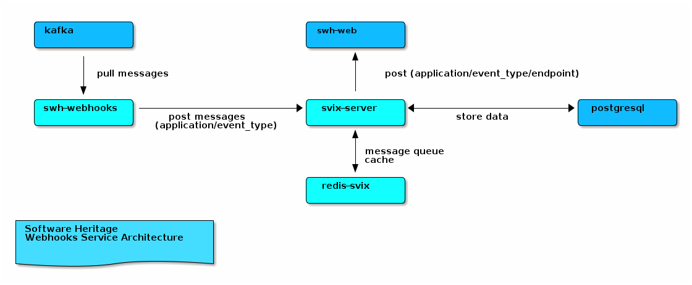

.. _webhooks-svix:

Webhooks Svix
=============

.. admonition:: Intended audience
   :class: important

   sysadm staff members

.. admonition:: Scope of commands
   :class: note

   For the following page, unless specified otherwise, the commands are executed from the sysadm computer.

* `Svix Overview <https://docs.svix.com/overview>`_
* `Svix Default Configuration <https://github.com/svix/svix-webhooks/blob/main/server/svix-server/config.default.toml>`_

.. _webhooks-svix-components:

Components
----------

* ``swh-webhooks``:
    - role: journal client
    - repository: ``swh-charts`` (swh)
    - namespace: swh (production), swh-cassandra (staging)
* ``svix-server``:
    - role: webhook server
    - repository: ``swh-charts`` (cluster-components)
    - namespace: svix-server
* ``redis``:
    - role: cache, message queue
    - repository: ``k8s-clusters-config`` (argocd-configuration/applications)
    - namespace: svix-server
* ``postgresql``:
    - role: database
    - server: ``albertina:5434``
    - db name: swh-svix

.. _webhooks-svix-architecture:

Architecture
------------

|webhooks_architecture|

.. admonition:: Generate a svix authentication token
   :class: note

   .. code:: console

      ᐅ kubectl --context archive-production-rke2 exec -ti \
      $(kubectl --context archive-production-rke2 get po -n svix-server -l app=svix-server -o name) \
      -n svix-server -- svix-server jwt generate
      Token (Bearer): XXX

   It will be necessary to register ``swh-webhooks`` in ``svix-server``.

.. _webhooks-svix-register-event-types:

Register default webhook event-types
------------------------------------

.. code:: console

   swh@webhooks-origin-visit-status:~$ swh webhooks event-type register-defaults
   swh@webhooks-origin-visit-status:~$ swh webhooks event-type list

   INFO:httpx:HTTP Request: GET https://svix.internal.softwareheritage.org/api/v1/event-type/?include_archived=false&with_content=true "HTTP/1.1 200 OK"
   Registered event types:

   origin.create:
     This event is triggered when a new software origin is added to the archive
   origin.visit:
     This event is triggered when a new visit of a software origin was performed

.. _webhooks-svix-register-endpoint:

Create webhook event-type endpoint
----------------------------------

.. admonition:: Get the web-archive secret
   :class: note

   .. code:: console

      ᐅ kubectl --context archive-production-rke2 exec -ti -n swh -c web-archive \
      $(kubectl --context archive-production-rke2 get pods -n swh -l app=web-archive -o name | awk 'NR == 1') \
      -- awk '/save_code_now_webhook_secret/{print $2}' /etc/swh/config.yml

      whsec_XXX

   Webhook secret must match the following regexp ``^whsec_[a-zA-Z0-9+/=]{32,100}$``.

.. code:: console

   swh@webhooks-origin-visit-status:~$ swh webhooks -C $SWH_CONFIG_FILENAME endpoint \
   create origin.visit "$URL" --secret "${TOKEN}"

   INFO:httpx:HTTP Request: GET https://svix.internal.softwareheritage.org/api/v1/event-type/origin.visit/ "HTTP/1.1 200 OK"
   INFO:httpx:HTTP Request: POST https://svix.internal.softwareheritage.org/api/v1/app/21dacaea-7e38-5e52-80af-4d926f0c43d1/endpoint/ "HTTP/1.1 201 Created"
   INFO:httpx:HTTP Request: PUT https://svix.internal.softwareheritage.org/api/v1/app/21dacaea-7e38-5e52-80af-4d926f0c43d1/endpoint/62d4603b-aec8-5ba9-8837-49be0f077bf3/headers/ "HTTP/1.1 204 No Content"

.. _webhooks-svix-delete-endpoint:

Delete webhook event-type endpoint
----------------------------------

From ``swh-webhooks``:

.. code:: console

   swh@webhooks-origin-visit-status:~$ URL=$(swh webhooks endpoint list origin.visit \
   2> /dev/null)
   swh@webhooks-origin-visit-status:~$ swh webhooks endpoint delete origin.visit "$URL"

   INFO:httpx:HTTP Request: GET https://svix.internal.staging.swh.network/api/v1/event-type/origin.visit/ "HTTP/1.1 200 OK"
   INFO:httpx:HTTP Request: DELETE https://svix.internal.staging.swh.network/api/v1/app/21dacaea-7e38-5e52-80af-4d926f0c43d1/endpoint/c82f7b48-8216-54cd-8930-9dadced85f87/ "HTTP/1.1 204 No Content"

From ``toolbox``:

.. code:: console

   swh@swh-toolbox:~$ APP_ID=$(./svix app list | jq -r '.data[] | \
   select(.name=="origin.visit") | .id')
   swh@swh-toolbox:~$ ENDPOINT_ID=$(./svix endpoint list "$APP_ID" | \
   jq -r '.data[] | select(.filterTypes==["origin.visit"]) | .id')
   swh@swh-toolbox-cbdf54845-5ckqt:~$ ./svix endpoint delete "$APP_ID" "$ENDPOINT_ID"

   Are you sure you want to delete the the endpoint with id: ep_2fajH3V05o7VLMAxMnaUgyBlQfT? [y/N] y█
   Endpoint "ep_2fajH3V05o7VLMAxMnaUgyBlQfT" Deleted!

.. _webhooks-svix-install-cli:

Install svix-cli on toolbox
---------------------------

.. code:: console

   swh@swh-toolbox:~$ wget -q https://github.com/svix/svix-cli/releases/download/v0.21.1/svix_Linux_x86_64.tar.gz
   swh@swh-toolbox:~$ tar xvzf svix_Linux_x86_64.tar.gz svix
   svix
   swh@swh-toolbox:~$ chmod +x svix
   swh@swh-toolbox:~$ awk '/auth_token|server_url/{print $2}' /etc/swh/config-webhooks.yml
   <XXX1>
   <XXX2>
   swh@swh-toolbox:~$ ./svix login

   Welcome to the Svix CLI, enter your auth token to get started!

   ✔ Svix Server URL: <XXX2>
   ✔ Svix Auth Token: <XXX1>

   swh@swh-toolbox:~$ cat .config/svix/config.toml
   auth_token = "XXX"
   color = "auto"
   server_url = "XXX"

.. _webhooks-svix-check-webhooks-applications:

Check webhooks applications
---------------------------

``swh-webhooks``
~~~~~~~~~~~~~~~~

.. code:: console

   swh@webhooks-origin-visit-status:~$ swh webhooks -C "$SWH_CONFIG_FILENAME" event-type list

   INFO:httpx:HTTP Request: GET https://svix.internal.softwareheritage.org/api/v1/event-type/?include_archived=false&with_content=true "HTTP/1.1 200 OK"
   Registered event types:

   origin.create:
     This event is triggered when a new software origin is added to the archive
   origin.visit:
     This event is triggered when a new visit of a software origin was performed

.. code:: console

   swh@webhooks-origin-visit-status:~$ swh webhooks -C "$SWH_CONFIG_FILENAME" endpoint list origin.visit

   INFO:httpx:HTTP Request: GET https://svix.internal.softwareheritage.org/api/v1/event-type/origin.visit/ "HTTP/1.1 200 OK"
   INFO:httpx:HTTP Request: GET https://svix.internal.softwareheritage.org/api/v1/app/21dacaea-7e38-5e52-80af-4d926f0c43d1/endpoint/?order=descending "HTTP/1.1 200 OK"
   https://archive.softwareheritage.org/save/origin/visit/webhook/

``svix-cli``
~~~~~~~~~~~~

.. code:: console

   swh@swh-toolbox:~$ APPLICATION=$(./svix app list | jq -r '.data[] | select (.name=="origin.visit") | .id')
   swh@swh-toolbox:~$ echo "$APPLICATION"
   app_2euZUZcVz4Hy5kyctOvLIl0Uy8J
   swh@swh-toolbox:~$ ./svix endpoint list "$APPLICATION" | \
      jq -r '.data[] | select(.filterTypes==["origin.visit"])'
   {
     "createdAt": "2024-04-23T13:37:43.389652Z",
     "description": "",
     "disabled": false,
     "filterTypes": [
       "origin.visit"
     ],
     "id": "ep_2fVHjwUWJ7TRJC2rnqoFO5cjuHm",
     "metadata": {},
     "rateLimit": null,
     "uid": "a0f2206d-2d21-580e-b1dc-4f4f1f8fd1af",
     "updatedAt": "2024-04-23T13:37:43.414656Z",
     "url": "https://archive.softwareheritage.org/save/origin/visit/webhook/",
     "version": 1
   }

.. _webhooks-svix-check-service-logs:

Check service logs
------------------

``swh-webhooks``
~~~~~~~~~~~~~~~~

.. code:: console

   ᐅ kail --context archive-production-rke2 -n swh -c webhooks

``svix-server``
~~~~~~~~~~~~~~~

.. code:: console

   ᐅ kail --context archive-production-rke2 -n svix-server -c svix-server

``postgresql``
~~~~~~~~~~~~~~

.. code:: postgres-console

   swh-svix=# select * from messageattempt where response_status_code = '403' limit 1;
   -[ RECORD 1 ]--------+----------------------------------------------------------------
   id                   | atmpt_2euhVJY9NbUimKxVPY4Z6Z16LNW
   created_at           | 2024-04-10 14:46:32.39531+00
   msg_id               | msg_2euhVJRF8bm1qRvNHkmgWbQADFf
   msg_dest_id          | msgep_2euhVJVfsO7HB9sUD23W54f1KeA
   endp_id              | ep_2euhUYHc78b3h5vapXbWCwzWBn9
   url                  | https://archive.softwareheritage.org/save/origin/visit/webhook/
   status               | 2
   response_status_code | 403
   response             | <html>\r                                                       +
                        | <head><title>403 Forbidden</title></head>\r                    +
                        | <body>\r                                                       +
                        | 
<h1>403 Forbidden</h1>
\r                      +
                        | 

nginx
\r                                   +
                        | </body>\r                                                      +
                        | </html>\r                                                      +
                        |
   ended_at             | 2024-04-10 14:46:32.545165+00
   trigger_type         | 0

``swh-web``
~~~~~~~~~~~

.. code:: console

   ᐅ kail --context archive-production-rke2 -n swh -c web-archive -l app=web-archive
