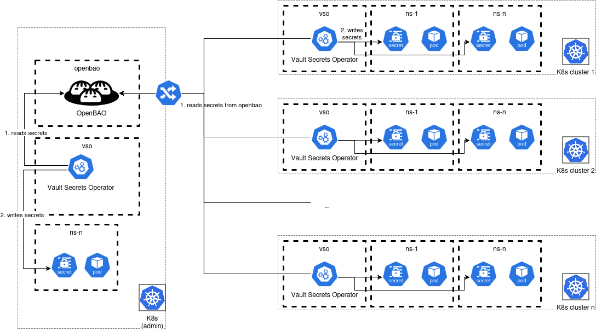
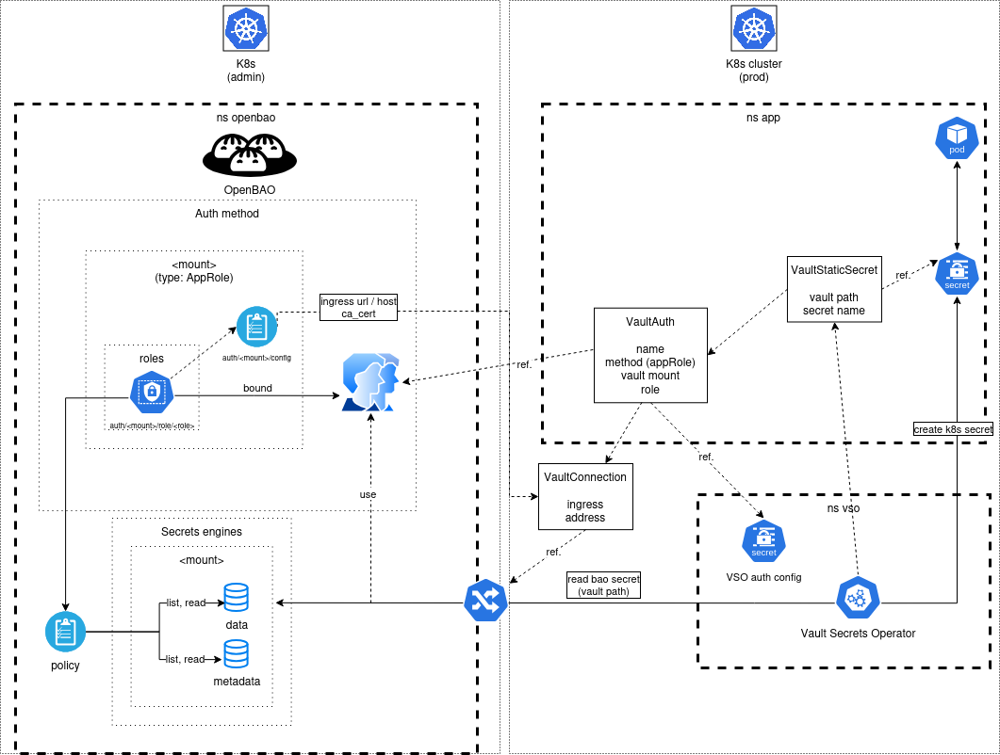
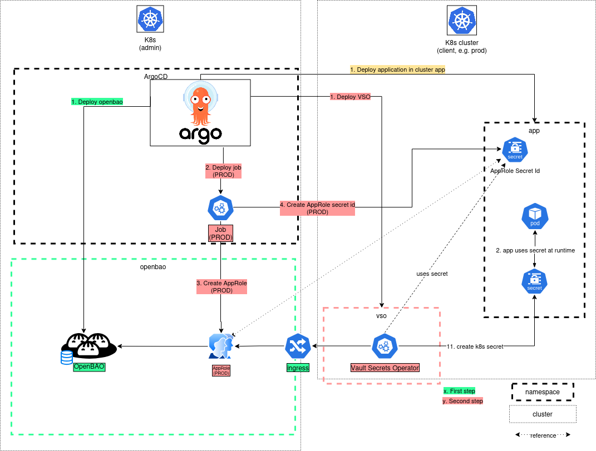
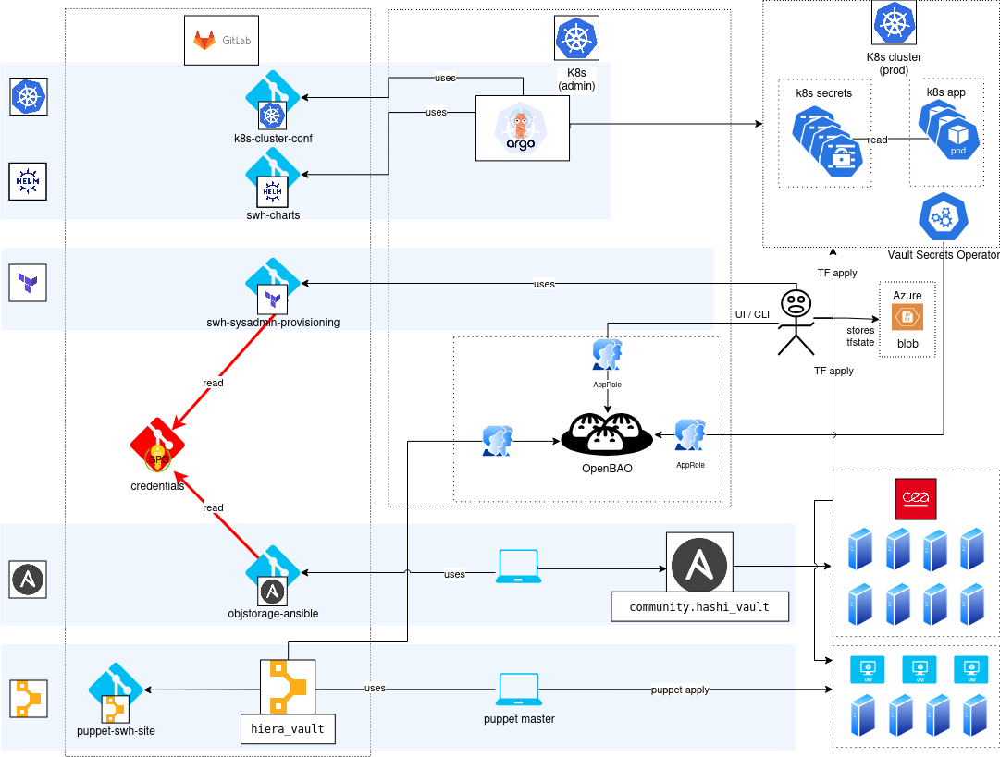

.. _secrets-management-architecture:

Secrets management architecture
===============================

.. admonition:: Intended audience
   :class: important

   staff members

1. Global Architecture
======================

OpenBao is deployed centrally within the **administration cluster
(k8s-admin)**, serving as the single *source of truth* for all
infrastructure secrets. This cluster hosts the OpenBao instance
alongside the **Vault Secrets Operator (VSO)**, which orchestrates
secret synchronization toward remote application clusters.

Each target Kubernetes cluster (K8s cluster 1, 2, n) runs its own
dedicated **VSO instance**, deployed in a ``vso`` namespace. The VSO
connects to OpenBao through an **Ingress** exposed from the
administration cluster, ensuring secure communication between remote
clusters and the central service.

This follows a **hub-and-spoke** model:

- OpenBao (the *hub*) distributes secrets.
- Each Kubernetes cluster (the *spokes*) consumes them locally.

Once fetched by the VSO, secrets are automatically injected into native
Kubernetes ``Secret`` objects within application namespaces
(``ns-1``, ``ns-n``, etc.).

Pods in those namespaces consume secrets directly from the local
Kubernetes API without ever needing to authenticate against OpenBao.

This architecture provides:

- **Centralized governance**
- **Local high-performance consumption**
- **Horizontal scalability**

Onboarding a new cluster only requires:

#. Deploying a VSO instance in the target cluster.
#. Configuring network access to the administration cluster Ingress.

2. Openbao/VSO
==============

Within the **administration cluster (k8s-admin)**, OpenBao runs in a
dedicated ``openbao`` namespace. It is configured with
**authentication methods** (notably **AppRole**), **roles** tied to
fine-grained **policies**, and one or more **secrets engines**,
each engine storing its data and metadata in isolation.

An **Ingress** exposes the OpenBao API externally, acting as the
single entry point for all consumer clusters.

The ``vso`` namespace hosts the **Vault Secrets Operator (VSO)**,
the sole component authorized to communicate with OpenBao.

The ``app`` namespace contains declarative resources and application
workloads. Three Custom Resource (CR) objects are defined there:

- ``VaultConnection``: specifies the Ingress URL and TLS certificates
  required to reach OpenBao.
- ``VaultAuth``: references the AppRole authentication method and the
  credentials stored in a Kubernetes secret.
- ``VaultStaticSecret``: designates the exact secret path to
  synchronize within OpenBao and the authentication policy to use.

The operational flow is fully automated by the VSO.

The operator continuously watches ``VaultStaticSecret`` objects in the
``app`` namespace. Upon detection, it uses ``VaultAuth`` to
authenticate against OpenBao via AppRole, then uses
``VaultConnection`` to resolve the address and establish a secure TLS
connection through the Ingress.

It then queries the secrets engine at the path specified in
``VaultStaticSecret``. Once the data is retrieved, the VSO creates or
updates a native Kubernetes ``Secret`` in the ``app`` namespace.

The application pod consumes this secret locally (through environment
variables or mounted volumes), without ever needing to know about
OpenBao or authenticate against it.

This architecture strictly decouples:

- **Centralized secret governance** in the administration cluster.
- **Local and secure secret consumption** in production clusters.

It also ensures automatic renewal through the VSO reconciliation loop.

3. Deployment
==============

Secret deployment is orchestrated end-to-end by **ArgoCD**,
ensuring a declarative and reproducible configuration.

On the **admin cluster**, ArgoCD instantiates OpenBao and then
executes an **initialization Job**. This Job performs the following
tasks:

- Creates an **AppRole** in OpenBao, defining access rights to the
  secret.
- Deposits the associated ``SecretID`` into a Kubernetes secret within
  the **production cluster**.

ArgoCD then deploys the application together with the
**Vault Secrets Operator (VSO)** in the production cluster.

The VSO detects the ``VaultStaticSecret`` resource and uses the
``SecretID`` to authenticate against OpenBao via AppRole through the
Ingress. It then fetches the secret value and immediately transcribes
it into a native Kubernetes ``Secret`` within the application
namespace.

The application pod consumes this secret **at runtime**, without ever
interacting directly with OpenBao.

The entire lifecycle is fully automated by ArgoCD and the VSO,
including:

- AppRole creation
- ``SecretID`` propagation
- Secret synchronization
- Application startup

4. Infrastructure With OpenBao
===============================

With OpenBao, secrets are:

- **Centralized**
- **Encrypted at rest**
- **Consumed on-demand** (*just-in-time*)

OpenBao, deployed in the admin cluster, becomes the single source of
truth for all infrastructure secrets.

Authentication for all automation tools, including **Terraform**,
**Ansible**, and **ArgoCD**, is unified through the **AppRole**
mechanism, eliminating hardcoded credentials.

The **Vault Secrets Operator (VSO)** automatically synchronizes secrets
to Kubernetes clusters, while the
``community.hashi_vault`` module enables Ansible to retrieve them
dynamically for servers and virtual machines.

Git-based credential repositories (whether GPG-encrypted or plaintext)
are decommissioned in favor of OpenBao.

This approach provides:

- Native encryption
- Automated secret rotation
- Full access audit trails
- End-to-end traceability

All of this is achieved without requiring modifications to consumer
applications.

5. Secret management workflow
==========

#. **Creation**

   A human operator defines the secret in **OpenBao**
   (for example ``/deposit/datasources/postgresql``)
   and pushes its value.

#. **Declaration**

   **ArgoCD** deploys a ``VaultStaticSecret`` resource in the
   target namespace (such as ``deposit`` or ``cnpg``),
   indicating to the VSO which secret path must be synchronized.

#. **Synchronization**

   The **Vault Secrets Operator (VSO)** reads the
   ``VaultStaticSecret``, authenticates against OpenBao via
   AppRole, retrieves the secret value, and creates a native
   Kubernetes ``Secret`` (for example
   ``postgresql-db-deposit``) in the application namespace.

#. **Consumption**

   Application pods, such as ``swh-deposit`` and
   ``db-deposit``, mount or consume this secret at runtime.

#. **Maintenance**

   ArgoCD and the VSO continuously ensure reconciliation:

   - Any change in OpenBao is automatically propagated.
   - Any configuration drift is automatically corrected.