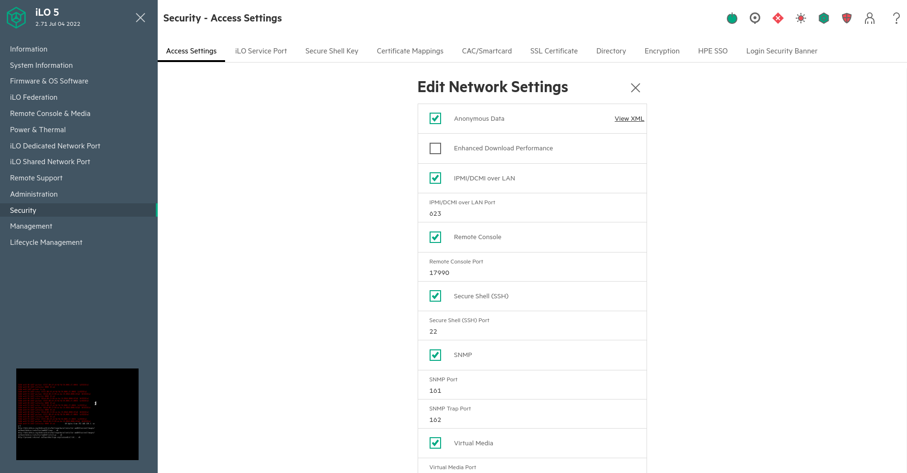

.. _server_architecture_install_physical:

How to install a new physical server
====================================

.. admonition:: Intended audience
   :class: important

   sysadm members

.. note::

   In the following documentation, we use a variable HOSTNAME to templatize
   the machine name to install. It's its short name. As this page is based on
   the **cassandra07** server installation, the HOSTNAME is set with
   it. Replace the hostname and other configurations (e.g IP address, ...)
   according to the installation need.

.. _build_the_iso_image:

Build the ISO image
-------------------

.. admonition:: Required packages
   :class: note

   .. code::

      sudo apt build-dep ipxe
      sudo apt install whois j2cli isolinux

Clone the SWH `ipxe <https://gitlab.softwareheritage.org/swh/infra/ipxe>`_
repository (in the branch ``swh``). Then place yourself at the top-level
directory of the checkout.

.. code::

   git clone git@gitlab.softwareheritage.org:swh/infra/ipxe.git

Create the variables template in ``ipxe/configs`` (you can find the
`IPADDRESS` in the `inventory
<https://inventory.internal.admin.swh.network/ipam/ip-addresses/>`_).

``ipxe/configs/cassandra07.yaml``

.. code:: yaml

   ---
   VLAN_ID: 440
   IPADDRESS: 192.168.100.187
   NETMASK: 255.255.255.0
   GATEWAY: 192.168.100.1
   NAMESERVER: 192.168.100.29
   HOSTNAME: cassandra07
   DOMAINNAME: internal.softwareheritage.org
   DEPLOYMENT: production
   SUBNET: sesi_rocquencourt
   BOOT_DISK_ID_PATTERN: "*_Boot_Controller_*"

When the server you install has no dedicated boot disk, replace the
`BOOT_DISK_ID_PATTERN` variable with these ones [1]_:

.. code:: yaml

   PARTMAN_METHOD: raid
   RAID_DISKS:
     - /dev/nvme0n1
     - /dev/nvme1n1

.. [1] Choose the disks dedicated to boot on which to mount a software RAID.

.. admonition:: Check the boot controller
   :class: note

   You can check if the server has a boot controller from the iLO web interface.

   .. figure:: ../images/infrastructure/iLO_boot-controller.png
      :alt: iLO_boot-controller.png

Then build the ISO image, the debian installer file and the finish_install
script with the script ``build_iso.sh``.

.. code::

   HOSTNAME=cassandra07
   ./configs/build_iso.sh $HOSTNAME

Copy only the necessary files on **preseed.internal.softwareheritage.org**
which is hosted on **pergamon**.

.. code::

   rsync -av --include="*/" --include="${HOSTNAME}.sh" --include="${HOSTNAME}.txt" \
   --exclude="*" configs/preseeding/ \
   pergamon.internal.softwareheritage.org:/srv/softwareheritage/preseeding/

.. admonition:: **pergamon** `DocumentRoot` tree like format
   :class: note

   .. code::

      /srv/softwareheritage/preseeding
      ├── cassandra07.txt
      ├── cassandra08.txt
      ├── finish_install
      │   ├── cassandra07.sh
      │   ├── cassandra08.sh
      │   └── finish_install.sh.j2
      └── preseed.txt.j2

.. _launch_the_iso_image_installation:

Launch the ISO image installation
---------------------------------

.. admonition:: iLO access
   :class: note

   See the :ref:`idrac` section to configure the iLO access.

Load the ISO image from the HTML5 console.

Then start the server and let the installation complete.

.. _ipmi_serial_console_access:

IPMI serial console access
--------------------------

You need to enable ``iLO Service Port`` to access the ``IPMI`` console. Go to
Security > column Network > click on the "pencil" (edit) icon.

Then you can follow the installation from a serial console.

.. code::

   IPADDRESS=$(pass show infra/$HOSTNAME/idrac | awk -F/ '/^Url/{print $NF}')
   LOGIN=$(pass show infra/$HOSTNAME/idrac | awk '/^User/{print $2}')
   PASSWORD=$(pass show infra/$HOSTNAME/idrac | head -1)

   ipmitool -I lanplus -H "$IPADDRESS" -U "$LOGIN" -P "$PASSWORD" sol activate

Note that you might have to adapt the HOSTNAME entry if the name does not match the
short name (e.g. sometimes, entry may be referenced with their fqdn instead).

To exit the console session, use ``~.``.

.. _post_installation:

Post installation
-----------------

The temporary root password is generated and stored in `ipxe
<https://gitlab.softwareheritage.org/swh/infra/ipxe>`_ repository under the
``gitignored`` file ``configs/passwords``.

Reference it in the credentials repository under ``infra/$HOSTNAME/root``.

.. code::

   awk -F: "/$HOSTNAME/ "'{print $2}' configs/passwords
   xxxxx-xxxxxx-xxxxxxxx-xxxxxx

Prepare the node if need be (e.g. zfs preparation) and finally run the Puppet
agent.

.. code::

   sudo apt install tmux puppet gnupg
   sudo puppet agent --vardir /var/lib/puppet \
     --server pergamon.internal.softwareheritage.org -t
