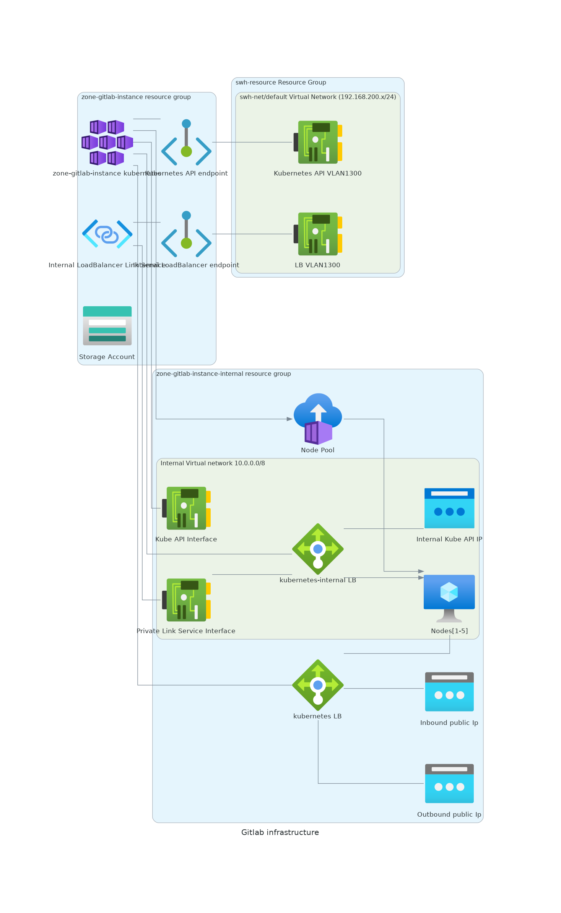

.. _gitlab_installation:

.. admonition:: Intended audience
   :class: important

   sysadm staff members

Gitlab installation
===================

The deployment of the gitlab instances is managed by:

  - terraform for the infrastructure part
  - ArgoCd for the Gitlab deployment

Each deployment relies on a dedicated `AKS` instance and a dedicated blob storage.

Infrastructure
--------------

The `terraform code
<https://gitlab.softwareheritage.org/infra/swh-sysadmin-provisioning/-/tree/master/azure/terraform/modules/gitlab>`__
is deploying and configuring a full, dedicated Azure Kubernetes Service matching this
environment:

(`source <https://archive.softwareheritage.org/swh:1:dir:713a9ee3a2191aa2a5f386798442bc321c0b4747;origin=https://forge.softwareheritage.org/source/snippets.git;visit=swh:1:snp:7336142b5e1a03be4eedfa3f9edc4552297abd82;anchor=swh:1:rev:3045f3c9cca4ff0611725bae143c0ccc5027ed4c;path=/sysadmin/docs/gitlab/>`__)

The output of terraform displays all the necessary information to connect to the
kubernetes cluster. It's also possible to get the information by executing those
commands:

.. code:: bash

    terraform output gitlab-<instance>_aks_summary
    terraform output --raw gitlab-<instance>_storage_summary

Once the infrastructure is created and available, Gitlab is deployed by ArgoCD. It's
done by deploying the `Gitlab Operator
<https://gitlab.com/gitlab-org/cloud-native/gitlab-operator>`__ and a gitlab
configuration (for example, the `staging configuration
<https://gitlab.softwareheritage.org/infra/ci-cd/k8s-swh-private-data/-/blob/master/gitlab-staging/gitlab-staging.yaml>`__).

A couple of other components are also deployed in parallel to manage the monitoring, an
additional ingress controller and cert-manager. The applications are available in the
`k8s-clusters-conf repository
<https://gitlab.softwareheritage.org/infra/ci-cd/k8s-clusters-conf/-/tree/master/argocd/applications/gitlab-staging>`__.

Important components
~~~~~~~~~~~~~~~~~~~~

- The gitlab transactional data is stored on a couple of kubernetes PVs associated to
  their relative Azure volumes

.. code:: bash

    kubectl -n gitlab-system get pv                                                                                                                                                                                                                                  17:36:19
    NAME                                       CAPACITY   ACCESS MODES   RECLAIM POLICY   STATUS   CLAIM                                                                                                               STORAGECLASS   REASON   AGE
    pvc-38afb357-36e4-4661-9be6-011f58a24c95   64Gi       RWO            Retain           Bound    gitlab-system/repo-data-gitlab-gitaly-0                                                                             default                 20d
    pvc-46544290-0278-4b41-b616-7466cd5140f9   8Gi        RWO            Retain           Bound    gitlab-system/data-gitlab-postgresql-0                                                                              default                 20d
    pvc-988b8047-2ac9-426b-8792-37d749141657   8Gi        RWO            Retain           Bound    gitlab-system/redis-data-gitlab-redis-master-0                                                                      default                 20d
    pvc-c55bdefa-089b-4cda-b0d0-a1daafb6f37f   16Gi       RWO            Retain           Bound    monitoring/prometheus-gitlab-production-promethe-prometheus-db-prometheus-gitlab-production-promethe-prometheus-0   default                 19d

By default, the operator use a `Delete` reclaim policy which is risky. After the initial
installation, it was manually changed to switch to a `Retain` policy

- The gitlab assets (attachments, container registry data, ...) are stored in a
  dedicated object storage account

Backups
-------

<Not yet available>

.. note:: The backup will be stored on a minio instance installed on the Rocquencourt infrastructure.
    see `#4645 <https://gitlab.softwareheritage.org/infra/sysadm-environment/-/issues/4645>`__

Upgrades
--------

An upgrade of gitlab is done in two major steps (**always test in staging before
upgrading the production environment**)

It's important to follow the operator releases (at most 3 minor versions late or the
migration will not be supported by the operator).

- Step 1 `Upgrade the operator
  <https://gitlab.com/gitlab-org/cloud-native/gitlab-operator/-/blob/master/doc/operator_upgrades.md>`__

    - Check the last `gitlab operator release
      <https://gitlab.com/gitlab-org/cloud-native/gitlab-operator/-/releases>`__ and the
      chart versions mapping
    - Update the operator version in the `application declaration
      <https://gitlab.softwareheritage.org/infra/ci-cd/k8s-clusters-conf/-/blob/master/argocd/applications/gitlab-staging/gitlab-operator.yaml>`__.
      `Example of upgrade
      <https://gitlab.softwareheritage.org/infra/ci-cd/k8s-clusters-conf/-/commit/1a349433d45623128deabe7ca4ca57b740e16cba>`__
    - Commit and push the change.
    - Wait a couple of minutes to let ArgoCD apply the change
    - A restart of the operator pod should happen (check the gitlab-controller-manager
      pod).
    - Something like this should be visible in the operator logs:

.. code:: shell

    > kubernetes logs gitlab-controller-manager-xxxx-xxxx
    Configuration error detected: chart version 6.5.1 not supported; please use one of the following: 6.5.2, 6.4.4, 6.3.5

At this point, the gitlab operator is updated but the Gitlab upgrade itself is not yet
started.

- Step 2 `Upgrade the gitlab version
  <https://gitlab.com/gitlab-org/cloud-native/gitlab-operator/-/blob/master/doc/gitlab_upgrades.md>`__

    - Follow the recommended upgrade path depending on the current deployed version of
      the gitlab instance and the allowed versions of the operator
    - Update the chart version matching the desired gitlab version (should be present on
      the release page of the operator) in the `gitlab resource declaration
      <https://gitlab.softwareheritage.org/infra/ci-cd/k8s-swh-private-data/-/blob/master/gitlab-staging/gitlab-staging.yaml>`__
    - Commit and push the change
    - Wait a couple of minutes to let ArgoCD apply the change
    - An upgrade of the gitlab services should happen and the launch of a migration pod
      should be done
    - After a couple of minutes (could be as long as an hour), the cluster should
      stabilize if everything is ok (no pending pods, no pods in error, ...)
    - Check the deployed version and the operator logs to check if nothing is wrong

.. code:: shell

    > kubectl -n gitlab-system get gitlab                                                                                                                                                                                                                          17:33:39
    NAME     STATUS    VERSION
    gitlab   Running   6.5.2
