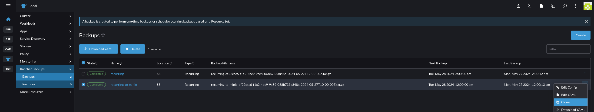
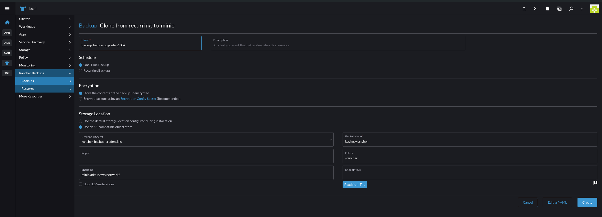
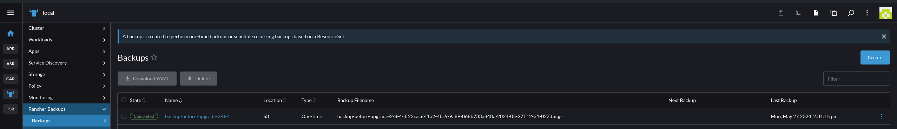
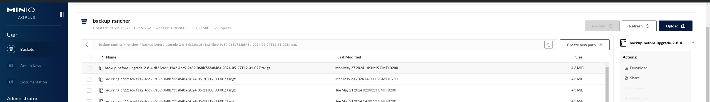
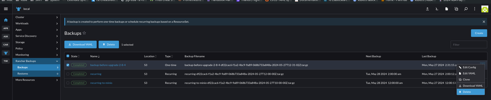
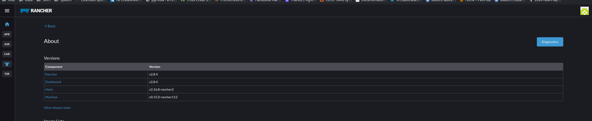

.. _rancher_howtos:

.. admonition:: Intended audience
   :class: important

   sysadm staff members

Rancher howtos
==============

How to connect to the underlying kubernetes
-------------------------------------------

- Add the following line in your `/etc/hosts`

.. code::

    192.168.200.18 euwest-rancher-3a905e13.1bef1012-0a93-4a25-8419-ac60363bf3d2.privatelink.westeurope.azmk8s.io

- Get the cluster credentials

.. code:: bash

    az aks get-credentials --resource-group euwest-rancher --name euwest-rancher  -f rancher-admin.yaml

- Test the connectivity

.. code:: bash

    kubectl --kubeconfig rancher-admin.yaml get nodes

.. _rancher_howtos_upgrade:

How to upgrade Rancher
----------------------

Create a backup
^^^^^^^^^^^^^^^

To create a backup, clone the existing backup ``recurring-to-minio`` and change the ``Schedule`` section to ``One-Time Backup``.

|rancher-upgrade-backup-01|

|rancher-upgrade-backup-02|

Once the new backup is completed, check its existence on ``minio-console.internal.admin.swh.network``, then delete it.

|rancher-upgrade-backup-03|

|rancher-upgrade-backup-04|

|rancher-upgrade-backup-05|

Upgrade Rancher version
^^^^^^^^^^^^^^^^^^^^^^^

In the repository ``k8s-clusters-config``, upgrade the ``targetRevision`` to the desired version in ``rancher-application``.

.. code:: diff

    argocd-configuration/applications/rancher/rancher-application.yaml
    [...]
    -    targetRevision: 2.8.3
    +    targetRevision: 2.8.4

Verify the upgrade
^^^^^^^^^^^^^^^^^^

Check the rancher deployment.

.. code:: bash

    kubectl --context local rollout status deploy/rancher -n cattle-system
    deployment "rancher" successfully rolled out
    kubectl --context local get deploy rancher -n cattle-system
    NAME      READY   UP-TO-DATE   AVAILABLE   AGE
    rancher   2/2     2            2           537d

Check the deployment logs.

.. code:: bash

    kubectl --context local logs deployments/rancher -n cattle-system

Check the server version.

.. code:: bash

    kubectl --context local describe pods -n cattle-system -l app=rancher | \
    awk '/Image:|^Name:|^Namespace:/'
    Name:                 rancher-58994f549-8s66c
    Namespace:            cattle-system
        Image:         rancher/rancher:v2.8.4
    Name:                 rancher-58994f549-z28lp
    Namespace:            cattle-system
        Image:         rancher/rancher:v2.8.4

Check the cluster agents version.

.. code:: bash

    for env in archive-production-rke2 archive-staging-rke2 cluster-admin-rke2 test-staging-rke2
    do echo "$env"
    kubectl describe --context "$env" pods -n cattle-system -l app=cattle-cluster-agent | \
    awk '/Image:|^Name:|^Namespace:|^Node:/'
    done
    archive-production-rke2
    Name:             cattle-cluster-agent-77b9596778-6spfr
    Namespace:        cattle-system
    Node:             rancher-node-metal02/192.168.100.132
        Image:          rancher/rancher-agent:v2.8.4
    Name:             cattle-cluster-agent-77b9596778-g4fgz
    Namespace:        cattle-system
    Node:             rancher-node-production-rke2-mgmt3/192.168.100.143
        Image:          rancher/rancher-agent:v2.8.4
    archive-staging-rke2
    Name:             cattle-cluster-agent-bb6bcc464-dm8wp
    Namespace:        cattle-system
    Node:             db1/192.168.130.11
        Image:          rancher/rancher-agent:v2.8.4
    Name:             cattle-cluster-agent-bb6bcc464-fnw45
    Namespace:        cattle-system
    Node:             rancher-node-staging-rke2-mgmt3/192.168.130.163
        Image:          rancher/rancher-agent:v2.8.4
    cluster-admin-rke2
    Name:             cattle-cluster-agent-544b88c686-pr4t9
    Namespace:        cattle-system
    Node:             rancher-node-admin-rke2-mgmt2/192.168.50.152
        Image:          rancher/rancher-agent:v2.8.4
    Name:             cattle-cluster-agent-544b88c686-svwm8
    Namespace:        cattle-system
    Node:             rancher-node-admin-rke2-mgmt3/192.168.50.153
        Image:          rancher/rancher-agent:v2.8.4
    test-staging-rke2
    Name:             cattle-cluster-agent-5bc6bd96cb-g7m5t
    Namespace:        cattle-system
    Node:             rancher-node-test-rke2-mgmt1/192.168.130.210
        Image:          rancher/rancher-agent:v2.8.4
    Name:             cattle-cluster-agent-5bc6bd96cb-pzqm4
    Namespace:        cattle-system
    Node:             rancher-node-test-rke2-worker2/192.168.130.212
        Image:          rancher/rancher-agent:v2.8.4

Check the ``cattle-system`` events.

.. code:: bash

    kubectl --context local events -n cattle-system

.. admonition:: Solve an ``imagepullbackoff`` error
   :class: Note

   On the node where the new image can't be pulled.

   .. code:: bash

       /var/lib/rancher/rke2/bin/ctr --address /run/k3s/containerd/containerd.sock \
       -n k8s.io images pull docker.io/rancher/rancher-agent:v2.8.4

Log into Rancher to confirm that the upgrade succeeded.

|rancher-upgrade-about|

