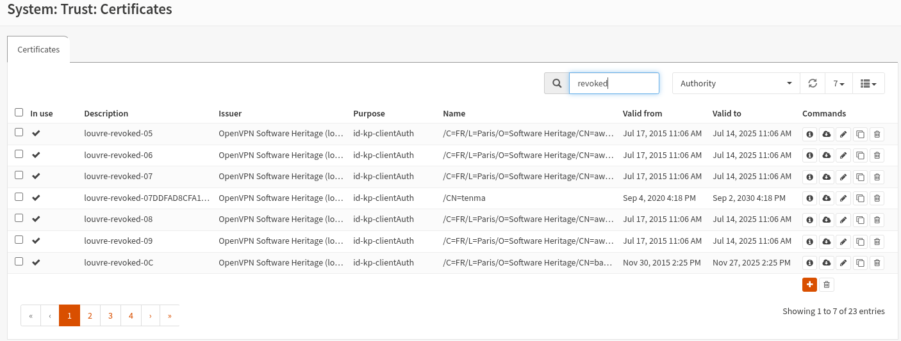
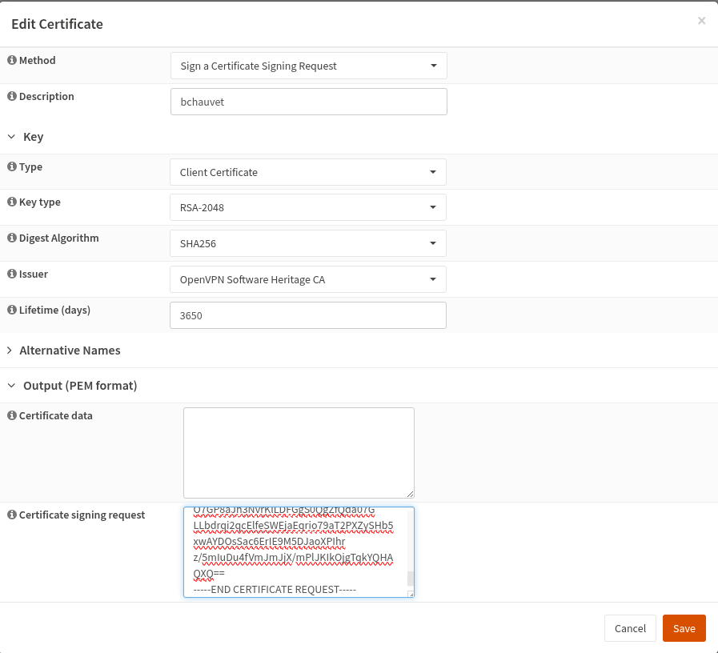
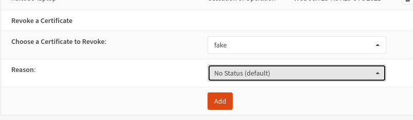
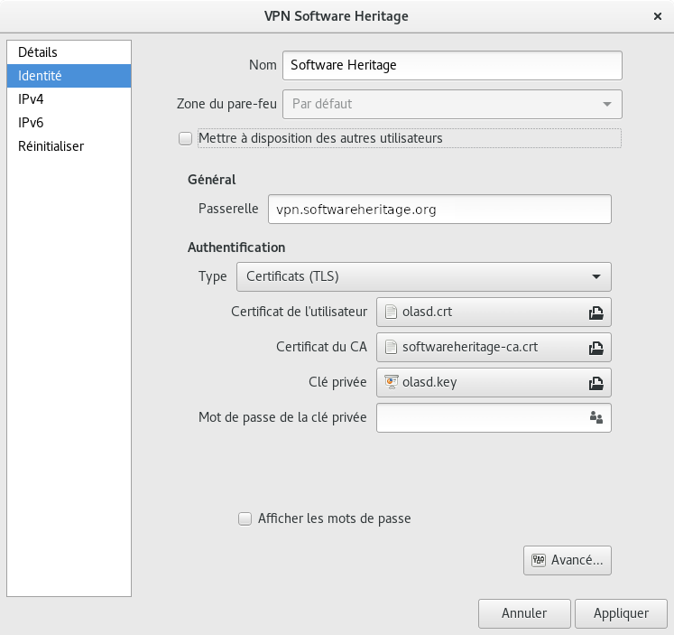
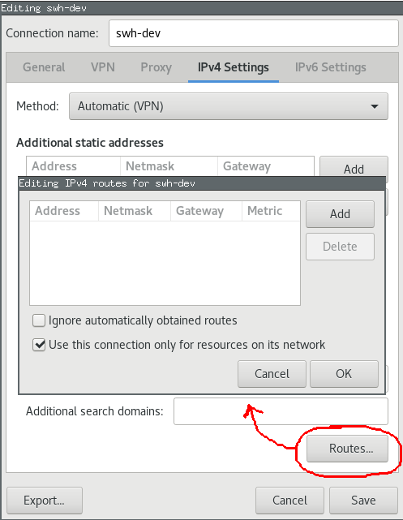
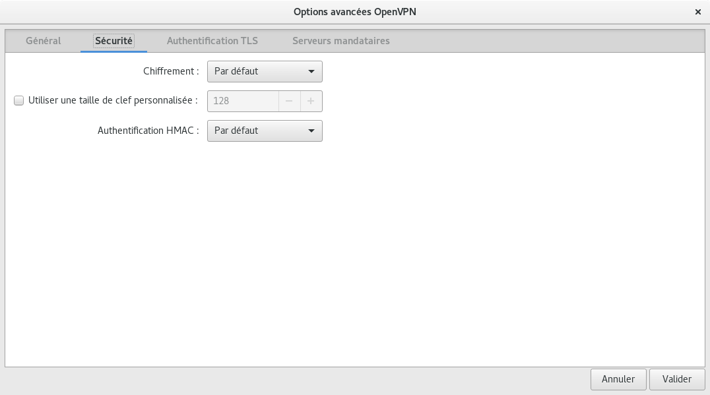
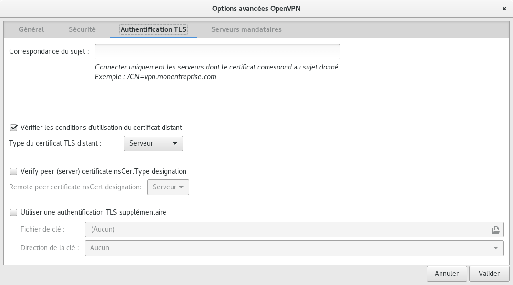

.. _howto_configure_openvpn:

How to configure OpenVPN
========================

.. admonition:: Intended audience
   :class: important

   staff members

The `Software Heritage <https://wiki.softwareheritage.org/wiki/Software_Heritage>`_
server and the VMs running on it are severely firewalled. To get onto their network
unrestricted, a VPN based on `OpenVPN <https://openvpn.net/>`_ is available.

The setup is client-server, with per-client certificates.

.. _openvpn_client_configuration:

OpenVPN client configuration
----------------------------

.. _raw_openvpn:

Raw OpenVPN
~~~~~~~~~~~

Sample configuration file, e.g., /etc/openvpn/swh.conf:

::

   remote vpn.softwareheritage.org
   ns-cert-type server
   nobind
   dev tun
   proto udp
   port 1194
   log /var/log/openvpn.log
   up-restart
   persist-key
   persist-tun
   client
   ca /etc/openvpn/keys/softwareheritage-ca.crt
   cert /etc/openvpn/keys/softwareheritage.crt
   key /etc/openvpn/keys/softwareheritage.key
   user nobody
   group nogroup

   # If you are using resolvconf, add this:
   # Make sure you add louvre to /etc/hosts to avoid issues in using the vpn-provided DNS server.
   script-security 2
   up /etc/openvpn/update-resolv-conf
   down /etc/openvpn/update-resolv-conf

   # If you want the connection to persist when your network fails, add this:
   ping-restart 10

In addition to the above configuration file, you will need to install the following 3
files under /etc/openvpn/keys (matching the paths within the sample above):

- :ref:`softwareheritage-ca.crt <softwareheritage-ca-crt>`: *public* certificate for the
  Software Heritage certification authority (CA)
- :ref:`softwareheritage.crt <openvpn_for_admins>`: *public*, client-specific (certificate
  signed by the admin, see below)
- :ref:`softwareheritage.key <openvpn_for_users>`: *private*, client-specific key (generated
  by the user, see below)

Activate the openvpn server, as root (on your machine), run:

.. code::

   NAME=swh  # or "work" as you wish
   systemctl enable openvpn@$NAME.service
   systemctl start openvpn@$NAME.service
   systemctl status openvpn@$NAME.service

Note: Internally, the ``swh`` must match the /etc/openvpn/``swh``.conf filename. You can
name it as you want (e.g ``work``), just be consistent about it.

Excerpt of a successful start:

.. code::

   root@machine:~# systemctl status openvpn@swh.service``
   openvpn@swh.service - OpenVPN connection to swh``
    Loaded: loaded (/lib/systemd/system/openvpn@.service; indirect; vendor preset: enabled)``
    Active: active (running) since Thu 2020-12-17 19:03:29 UTC; 22min ago``
      Docs: man:openvpn(8)``
            ``\ ```https://community.openvpn.net/openvpn/wiki/Openvpn24ManPage`` <https://community.openvpn.net/openvpn/wiki/Openvpn24ManPage>`_
            ``\ ```https://community.openvpn.net/openvpn/wiki/HOWTO`` <https://community.openvpn.net/openvpn/wiki/HOWTO>`_
    Main PID: 12302 (openvpn)``
      Status: "Initialization Sequence Completed"``
       Tasks: 1 (limit: 4915)``
      CGroup: /system.slice/system-openvpn.slice/openvpn@swh.service``
              └─12302 /usr/sbin/openvpn --daemon ovpn-swh --status /run/openvpn/swh.status 10 --cd /etc/openvpn --script-security 2 --config /etc/openvpn/swh.conf --writepid /run/openvpn/swh.pid``

      Dec 17 19:03:29 machine systemd[1]: Starting OpenVPN connection to swh...
      Dec 17 19:03:29 machine systemd[1]: Started OpenVPN connection to swh.

.. _network_manager_gui:

Network Manager GUI
~~~~~~~~~~~~~~~~~~~

You need network-manager-openvpn and network-manager-openvpn-gnome for the configuration
gui.

|nm-openvpn-base.png| |nm-openvpn-routes.png|
|nm-openvpn-advanced-security.png|
|nm-openvpn-advanced-tls-auth.png|

.. _obtaining_a_client_certificate:

Obtaining a client certificate
------------------------------

.. _openvpn_for_users:

For users
~~~~~~~~~

Generate a key pair (key + certificate signing request) using the following command:

.. code::

   openssl req -new -newkey rsa:2048 -nodes -keyout openvpn.key -out openvpn.csr -subj "/CN=<your username>"

Please replace with something that uniquely identifies the certificate.

Make sure openvpn.key is stored in a safe place (it's your private key, which will allow
anyone to connect to the VPN).

Provide the CSR file to a sysadmin through a reasonably authenticated medium.

.. _openvpn_for_admins:

For admins
~~~~~~~~~~

- Check the details of the CSR (especially the Common Name)

.. code:: bash

   openssl req -noout -text -in test.csr
   openssl req -noout -text -in test.csr | awk '/Subject:/'

- On the firewall (192.168.50.1), go to the `System / Trust / Certificates page <https://192.168.50.1/ui/trust/cert>`_
- Click on the ``+`` button on the bottom right



- On the Method list, choose "Sign a Certificate Signing Request"
- Enter the user name on the description field
- Select "OpenVPN Software Heritage CA" as ``Issuer``
- Enter the duration, usually 10 years
- Paste the csr
- Save



.. _revoking_a_client_certificate:

Revoking a client certificate
-----------------------------

On the firewall (master) `1 <https://192.168.50.1>`_:

- go to the `https://192.168.50.1/system_crlmanager.php System / Trust / Revocation
  <https://192.168.50.1/system_crlmanager.php_System_/_Trust_/_Revocation>`_ page
- edit the "OpenVPN certificate revocation list" CRL


- go to the bottom of the page



- select the certificate to revoke
- Add

The counter of revoked certificate should be increased by one on for the OpenVPN CSR on
the CSR list.





