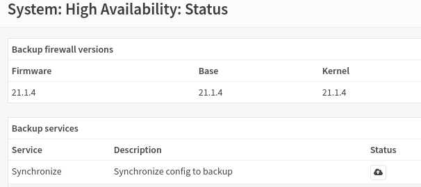
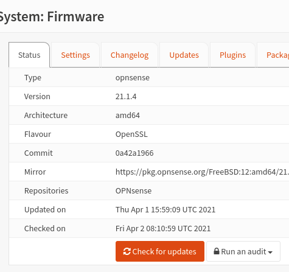
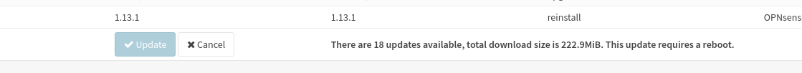

.. _upgrade_firewall_os:

How to upgrade firewall OS
==========================

.. admonition:: Intended audience
   :class: important

   sysadm staff members.

Initial status
^^^^^^^^^^^^^^

This is the nominal status of the firewalls:

.. list-table::
  :header-rows: 1

  * - Firewall
    - Status
  * - pushkin
    - PRIMARY
  * - glyptotek
    - BACKUP

Preparation
^^^^^^^^^^^

* Connect to the `principal <https://pushkin.internal.softwareheritage.org>`_ (pushkin
  here)
* Check the `CARP status
  <https://pushkin.internal.softwareheritage.org/carp_status.php>`_ to ensure the
  firewall is the principal (must have the status MASTER for all the IPS)
* Connect to the `backup <https://glyptotek.internal.softwareheritage.org>`_ (glytotek
  here)
* Check the `CARP status
  <https://glyptotek.internal.softwareheritage.org/carp_status.php>`__ to ensure the
  firewall is the backup (must have the status BACKUP for all the IPS)
* Ensure the 2 firewalls are in sync:

  * On the principal, go to the `High availability status
    <https://pushkin.internal.softwareheritage.org/status_habackup.php>`_ and force a
    synchronization
  * click on the button on the right of ``Synchronize config to backup``

* Switch the principal/backup to prepare the upgrade of the master (The switch is
  transparent from the user perspective and can be done without service interruption)

  * [1] On the principal, go to the `Virtual IPS status
    <https://pushkin.internal.softwareheritage.org/carp_status.php>`_ page
  * Activate the CARP maintenance mode

  .. image:: ../images/infrastructure/network/carp_maintenance.png

  * check the status of the VIPs, they must be ``BACKUP`` on pushkin and ``PRIMARY`` on glyptotek

* wait a few minutes to let the monitoring detect if there are connection issues, check
  ssh connection on several servers on different VLANs (staging, admin, ...)

If everything is ok, proceed to the next section.

Upgrade the first firewall
^^^^^^^^^^^^^^^^^^^^^^^^^^

Before starting this section, the firewall statuses should be:

.. list-table::
  :header-rows: 1

  * - Firewall
    - Status
  * - pushkin
    - BACKUP
  * - glyptotek
    - PRIMARY

If not, be sure of what you are doing and adapt the links accordingly

* [2] go to the `System Firmware: status
  <https://pushkin.internal.softwareheritage.org/ui/core/firmware#status>`_ page
  (pushkin here)
* Click on the ``Check for upgrades`` button

* follow the interface indication, one or several reboots can be necessary depending to
  the number of upgrade to apply

* repeat from the ``Check for upgrades`` operation until there is no upgrades to apply
* Switch the principal/backup to restore ``pushkin`` as the principal:

  * on the current backup (pushkin here) go to `Virtual IPS status
    <https://pushkin.internal.softwareheritage.org/carp_status.php>`_
  * [3] click on `Leave Persistent CARP Maintenance Mode`

  .. image:: ../images/infrastructure/network/reactivate_carp.png

  * refresh the page, the role should have changed from ``BACKUP`` to ``MASTER``
  * check on the other firewall, if the roles is indeed ``BACKUP`` for all the IPs

* Wait few moment to ensure everything is ok with the new version

Upgrade the second firewall
^^^^^^^^^^^^^^^^^^^^^^^^^^^

Before starting this section, the firewall statuses should be:

.. list-table::
  :header-rows: 1

  * - Firewall
    - Status
  * - pushkin
    - PRIMARY
  * - glyptotek
    - BACKUP

If not, be sure of what you are doing and adapt the links accordingly

* Proceed to the second firewall upgrade

  * perform [1] on the backup (should be ``glyptotek`` here)
  * perform [2] on the backup (should be ``glyptotek`` here)
  * perform [3] on the backup (should be ``glyptotek`` here)
