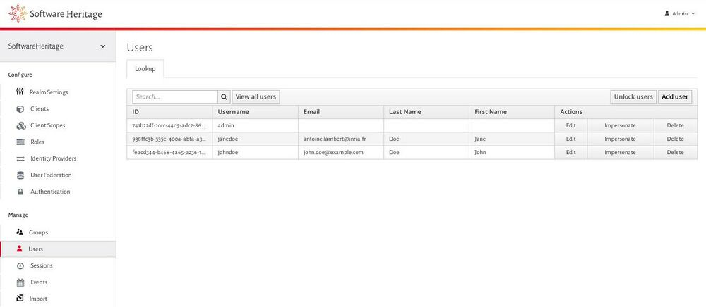
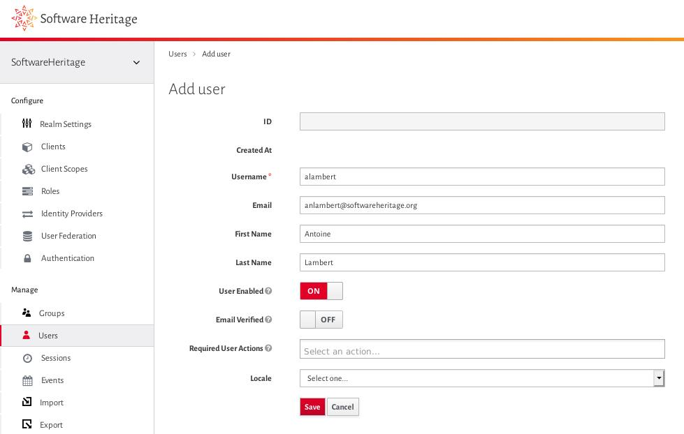
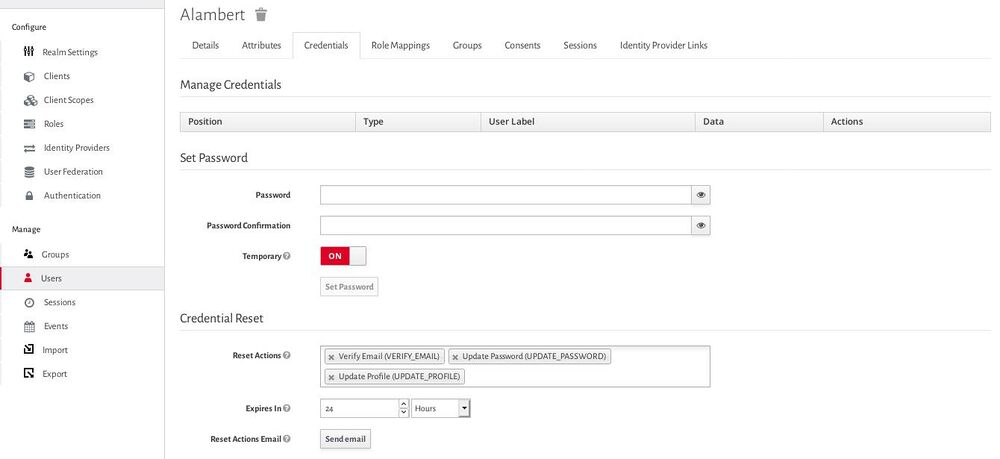
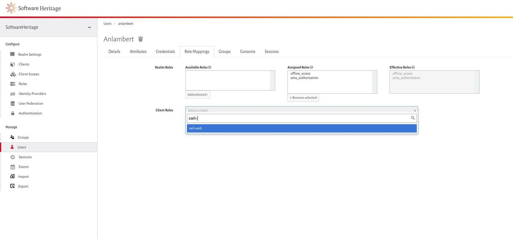
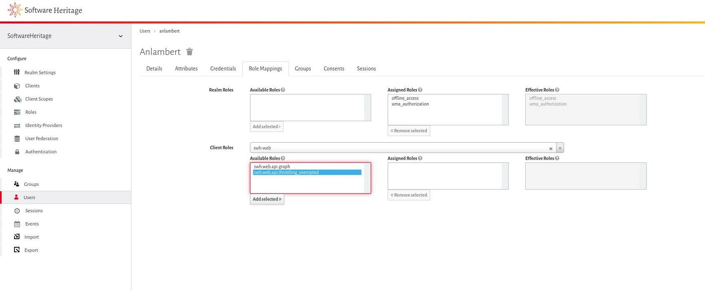
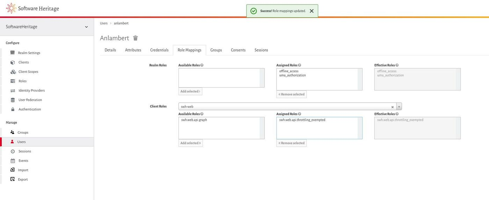

.. _realm_administration:

Realm administration
====================

.. admonition:: Intended audience
   :class: important

   Operation Staff members

.. _user_registration:

User registration
^^^^^^^^^^^^^^^^^

While public user registration is available by clicking on the "Register" link from the
login page, realm administrators can still manually create a new user by following that
guide.

To register and invite a new user in a realm, click on the **Users** menu entry on the
left part of the admin interface, then click on the **Add user** button on the top right
part of the users page.

   Click on the Add user button

Then fill in the form with basic information about the user: username,
email, first name and last name.

Save the user and then go to the **Credentials** tab.

   Fill in information on user

We are now going to send a mail to the user telling him that an account
has been created for him with a link to verify his email, set his
password and update its profile if needed.

Go to **Credential Reset** section and insert the **Verify Email** , **Update Password**
and **Update Profile** actions into the **Reset Actions** field. Increase the **Expires
In** value to 24 hours and then click on **Send Mail**.

   Send the invite and reset password email

The user account will be active once the email verified, the password changed and the
profile validated.

.. _setting_user_permissions_for_a_given_client:

Setting user permissions for a given client
^^^^^^^^^^^^^^^^^^^^^^^^^^^^^^^^^^^^^^^^^^^

User permissions are defined as client roles in the Keycloak semantics. That guide
explains how to set client roles for an existing user.

As an example, we will set the **swh.web.api.throttling_exempted** role associated to
the **swh-web** client enabling to lift rate limit for the Software Heritage Web API.

To edit a user, click on the **Users** menu entry on the left part of the admin
interface, then click on the **View all users** button on the top left part of the users
page.

Then select the user you want to set permission and click on the
**Edit** action.

.. figure:: ../../images/keycloak_add_user_permission_01.jpg
   :alt: keycloak_add_user_permission_01.jpg
   :width: 1400px

   List and select user for edition

Once the user details interface is displayed, click on the **Role Mappings** tab then
type the name of the client containing the roles to add for the user in the **Client
roles** combobox and select it.

The client roles will then be displayed in multiple lists.

   Edit the client role

To add a client role for the user, select the one of interest in the **Available Roles**
list and click on the **Add selected** button.

To remove a client role for the user, select the one of interest in the **Assigned
Roles** list and click on the **Removed selected** button.

And that's it, assigned roles can then be found in the JSON Web Tokens generated by
Keycloak.

   Assign client role

   Client role assigned
